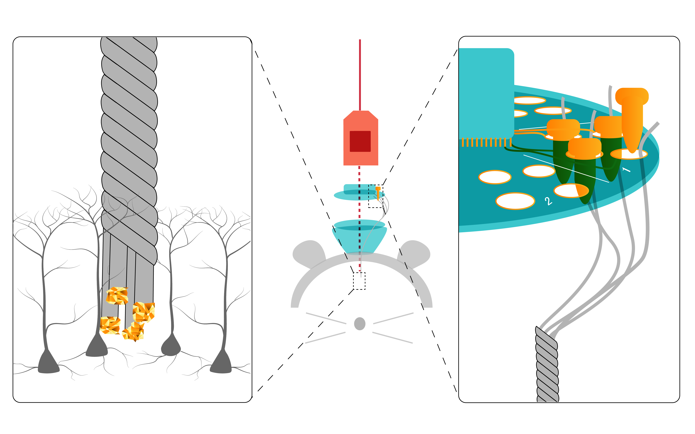
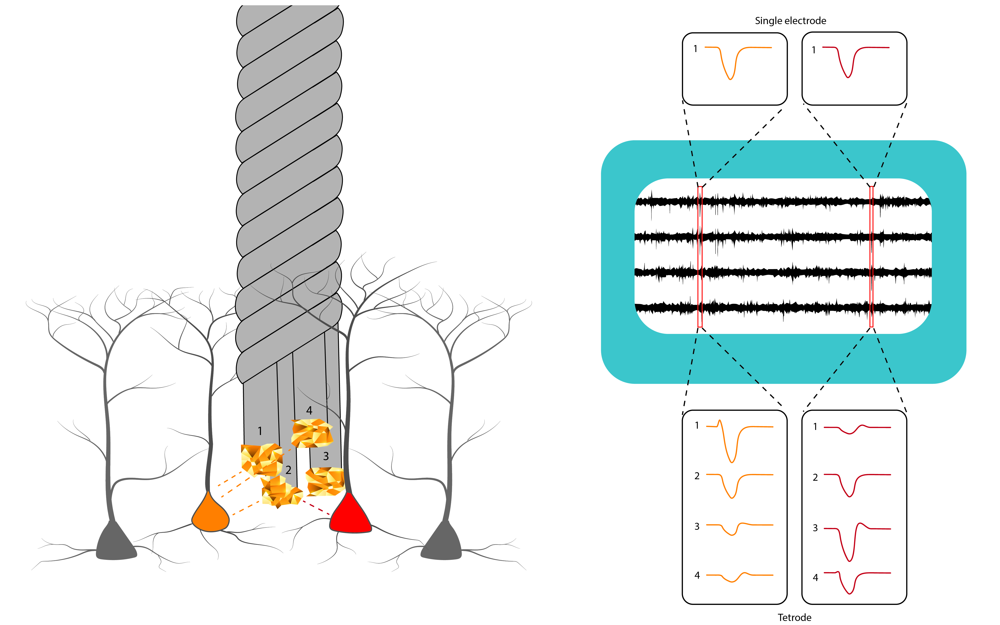
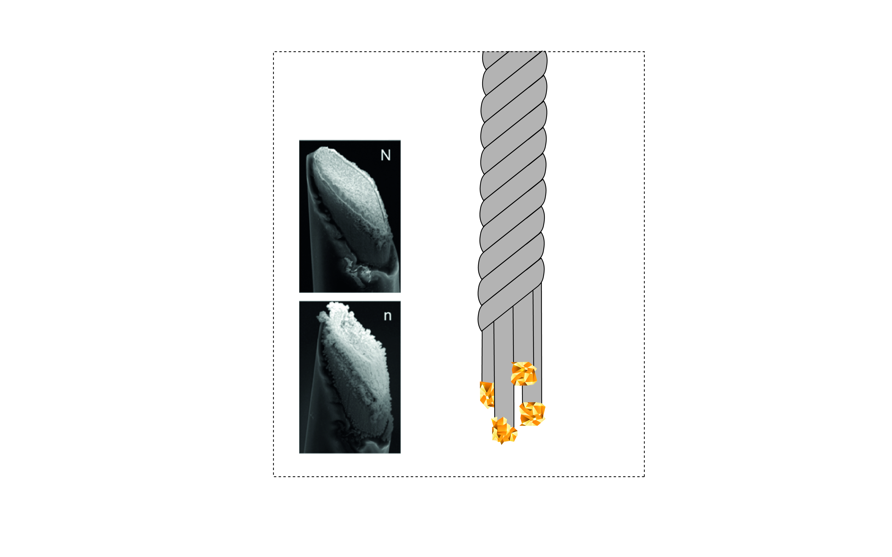

:notoc:
.. _reftetrodeintro:

Introduction to Tetrodes
============================

This is the part of the acquisition system that actually interacts with the brain. Tetrodes are a specific type of electrode, made up of four individual wires. These are twisted together and then heated to seal in place. 
The very ends of the tetrode wires are not insulated (left insert on image), making the tetrode sensitive to changes in the strength of the electric field at the tips. Electric field strength fluctuates with movement of charges such as during an action potential or synaptic input. 
Tetrodes are usually held in place with a tetrode drive such as the :ref:`shuttleDrive <refshuttledrive>` which is attached to the skull and allows individual tetrodes to be lowered into the brain to target the cells of interest.
At the top of the tetrode, each individual wire is pinned to a separate channel on the Electrode Interface Board (EIB,  right insert). Gold pins ensure good contact between the tetrode and the conducting vias (holes) in the interface board. Data from each channel travels on to the headstage. In the headstage chip, signals are amplified and digitized before being sent to the :ref:`Acquisition Board<refacboard>`.  
 
For clarity, only one tetrode is shown here, but the mouse shuttleDrive can hold 16 tetrodes (64 channels).

Why use tetrodes?
*******************
Each tetrode has four conducting tips, which are all at slightly different places in the tissue. This gives us an advantage when trying to assign spikes to separate neurons. If a neuron close to the tetrode spikes, the action potential is likely to be picked up by multiple channels, each at a different distance to the cell. Having the same spike recorded on 4 channels gives us a 4-dimensional ‘description’ of a spike, making it easier to distinguish spikes from different individual cells, increasing the number of single units we can record from in one go. 

For instance, in the image on the left, we can see our tetrode with two neighbouring cells (orange and red). On the right, our analysis has found two events (red squares) which cross our event detection threshold. If we were recording from a single electrode, it would be difficult or impossible to discover whether these spikes were from the same or from different cells. However, because we can see the same spike on four channels, we have much more information. On some channels the orange cell has a much higher amplitude than the red cell, giving us a higher chance of separating these units and getting an overall higher yield of cells per recording. 

Another advantage of tetrodes is that external noise and multi-unit activity is typically the same across channels. If your spike is different across channels, this is helpful confirmation that it is a real neuron and not just noise. 

Making tetrodes 
*******************

Making tetrodes requires thin insulated metal wire (often 12 um nichrome), a method to twist the wires together, and a hot air source to seal the insulation coating together. Making tetrodes is a lot easier and faster using a :ref:`tetrode twister <reftwister3>`. Different designs are available. Tetrode twisters automate the physical twisting of the wires and often hold the wire in place, controlling how much pull is placed on each of the four wires. 
Before use, tetrode tips are electroplated, often with gold, which stacks on to the tips and greatly increases their surface area (see insert on right, from S.A. Desai et al. Front. Neuroeng., 06 May 2010). This plating reduces tip resistance and results in less voltage attenuation (and precious signal lost) across the electrode, before it reaches the amplifier in the headstage. To plate electrodes you will need a way to measure impedance (to check it is decreasing with plating) and a current generator (to actually plate). Impedance should be 1-3 MOhm before plating and decrease to 250-350 KOhm. Make sure that impedance does not go much lower, this is likely to be due to short-circuiting (i.e. two wires of the tetrode becoming connected). If plating does not reduce impedance, cut the tip and try again. 
Once you’ve loaded tetrodes into the tetrode drive,  you’ve gold-plated and you’re sure you won’t have to replace tetrodes, you can attach the EIB to the shuttleDrive body. Gently twist the EIB when you place it on so that all the tetrode wires are safely protected inside the drive body. Make sure the EIB is glued on well to the drive body. 

