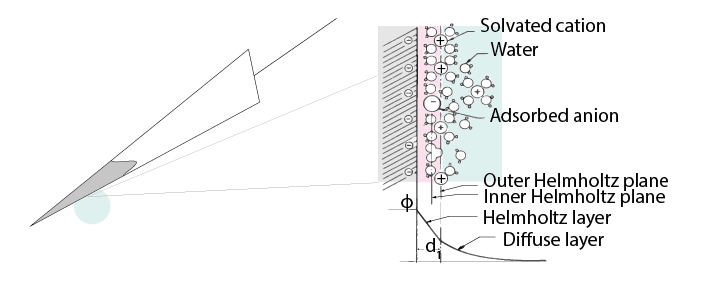

:notoc:
.. |Ve| replace:: V\ :sub:`e`\
.. |Ce| replace:: C\ :sub:`e`\
.. |Rm| replace:: R\ :sub:`m`\
.. |Re| replace:: R\ :sub:`e`\
.. |Cs| replace:: C\ :sub:`s`\
.. |Vin| replace:: V\ :sub:`in`\
.. |Vec| replace:: V\ :sub:`ec`\
.. |Vout| replace:: V\ :sub:`out`\
.. |Na+| replace:: Na\ :sup:`+`\
.. |K+| replace:: K\ :sup:`+`\
.. |Ca2+| replace:: Ca\ :sup:`2+`\
.. |Cl-| replace:: Cl\ :sup:`-`\
***********************************
Electrodes
***********************************
The electrode detects changes in the electric potential of the extracellular fluid due to `neuronal activity <_refephyssignals>`_, and passes this signal on to the rest of the recording system.

Extracellular microelectrodes are usually made from metallic conductors. A thin insulated metal wire with an exposed tip is the most basic, and still widely used, device for in vivo extracellular recording from brains. Twisting four such wires gives you a `tetrode <_reftetrodeintro>`_. Metals such as platinum, gold, tungsten, iridium, titanium nitride, stainless steel, iridium, iridium oxide, and alloys, nickel-chrome, platinum-iridium and platinum-tungsten have all been used in neural electrodes.

How does an electrode detect voltage changes?
************************************************

The double-layer interface
************************************************

.. raw:: html

  
<i>The double layer interface between an electrode and the extracellular fluid.</i>

Cellular activity causes time-varying changes in electric potential in the extracellular fluid. The transition from ion flow in the extracellular space to electron flow in the electrode occurs at the double layer interface. When a metal is placed in a saline solution two phenomena occur:
1) Water dipoles close to the metal surface become oriented
2) Assuming the metal surface is negatively charged, the solution close to the metal surface become depleted of negative ions (anions), leaving behind a cloud of positive ions (cations). This cloud of cations screens the electric field caused by the excess of charge on the metal.

Electroneutrality across the interface requires that the charge on the metal side is always equal and opposite to the total charge on the solution side of the interface (Musa et al., 2012). The resulting charge distribution - two narrow regions of equal and opposite charge - is known as the electrical double layer (EDL). The double layer region (represented in pink in the schematics) is less conductive than the metal electrode on one side and conductive extracellular fluid on the other. Due to this configuration, it becomes a `capacitor <_refcapacitors>`_ with a typical capacitance (Ce) around 20 μF cm-2 (Musa, 2011). The EDL also has a certain `resistance <_refresistance>`_ (Re) to charge flowing directly across it.

.. image:: ../_static/images/sh_fig-29.png
  :align: center

.. raw:: html

  
<i> The equivalent circuit describes the electrical properties of the double-layer interface between electrode and extracellular fluid.</i>

In the above figure, the interface between the solution and the electrode is represented by a parallel ReCe combination in series with resistances Rm (resistance of the metal electrode) and Rs (the resistance of the solution/extracellular fluid).

•	|Re| represents leakage resistance; the charge transfer due to charge carriers crossing the electrical double layer.
•	|Ce| is the capacitance of the electrical double layer at the interface of the exposed metal and the solution.

Because the resistance of the extracellular fluid |Rs| is small and independent of the electrode or acquisition system, we often simplify our equivalent circuits by leaving this value out.

There are two main mechanisms through which signals are detected by electrodes. If |Re| is small, current flow over the resistance bypasses the capacitor, and the electrical double layer is primarily a resistor. These are 'non-polarized' electrodes. If |Re| is large, as in 'polarised' electroddes, the capacitance of the electrical double layer becomes more important.

Non-polarized electrodes
***********************************
The well-known silver-silver chloride (Ag-AgCl) electrode approaches the ideal nonpolarizable type. In these ‘charge transfer’ electrodes, surface-confined species are oxidized and reduced (Bard & Faulkner, 2001, Merrill et al., 2005). Non-polarizable electrodes have a small |Re|, allowing charges to directly travel across the electrode-solution interface. If |Re| is small, it bypasses the capacitor |Ce|, providing a direct path for the measurement of steady potential levels.

Polarized electrodes
***********************************
Alternatively, if |Re| is large, no charge can directly flow between the electrode and the extracellular fluid. Instead, signal detection is of a `capacitive <_refcapacitors>`_ nature, involving the charging and discharging of the electrode-solution double layer (Cooper, 1971). In this case, cellular activity causes time-varying changes in electric potential in the extracellular fluid. This alters the difference in electric potential between the electrode and the extracellular fluid; i.e. it changes the electric potential across a capacitor, in turn changing how much charge the capacitor can separate. Adding or removing charges on one side (the extracellular fluid) necessarily leads to the same happening on the other side of the capacitor (the electrode), inducing ion flow in the electrode without charged particles being directly exchanged between them.

This happens with noble metal (e.g., stainless steel, gold and platinum) electrodes, where no charge transfer can occur across the metal-solution interface. To give an example, a tungsten microelectrode like the one used by Hubel and Wiesel in the 1950’s and 60’ has:

* |Rm| ~ 10 to 100 Ohm (Rm= (resistivity x length)/ cross sectional area),
* |Ce| ~ 0.2 pF / um2 ~ 10 - 20 pF (unplated)
* |Re| ~ 10 to 100 MOhm.
